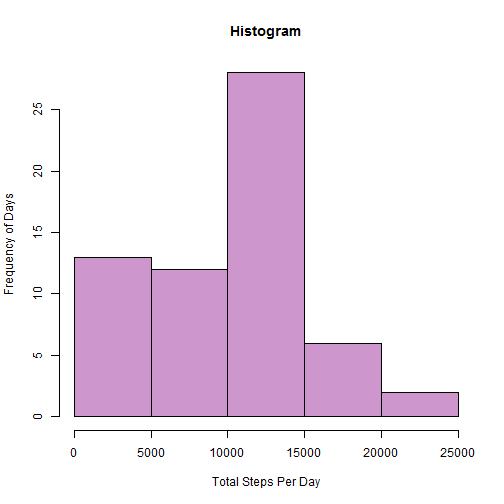
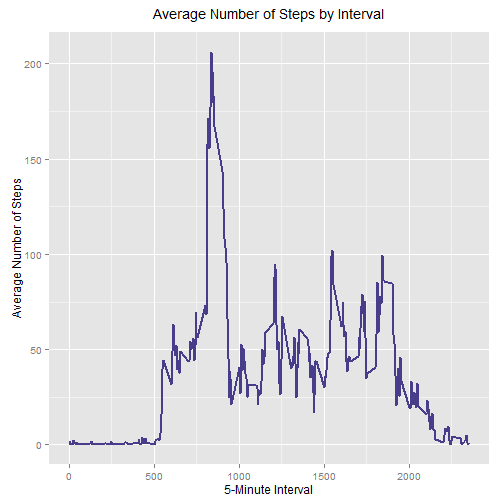
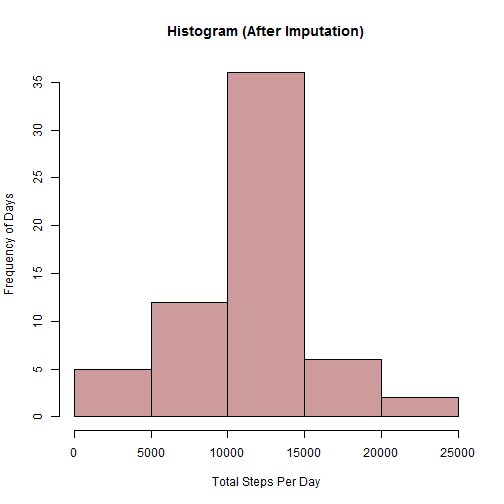
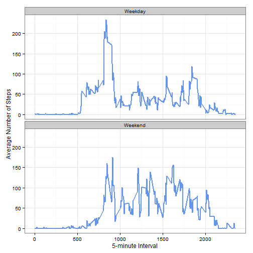

---
output:
  html_document:
    fig_caption: yes
    keep_md: yes
    self_contained: no
---
<h1>Reproducible Research: Peer Assessment 1</h1>
<p>
The data for this assignment comes from a personal activity monitoring device. This device collects data at 5 minute intervals through out the day. The data consists of two months of data from an anonymous individual collected during the months of October and November, 2012 and include the number of steps taken in 5 minute intervals each day.
</p>
<p>
<font size=+2><b>Loading and preprocessing the data</b></font>

The data is first downloaded from the course website and stored as stepsdata.

<br>1. Load the full dataset into "stepsdata

</p>
<p>
<font size=+2><b>What is the mean total number of steps taken per day?</b></font>

<br>1. Summarise data for total number of steps taken per day


<br>2. Plot histogram for total number of steps taken per day



<br>3a. Calculate mean of the total number of steps taken per day

```
## [1] 9354.23
```

<br>3b. Calculate median of the total number of steps taken per day

```
## [1] 10395
```
</p>
<p>
<font size=+2><b>What is the average daily activity pattern?</b></font>

<br>1a. Summarise data for average number of steps taken by interval


<br>1b. Plot line chart for average daily activity pattern i.e. number of steps based on interval



<br>2. Calculate which 5-minute interval contains the maximum number of steps, on average across all the days in the dataset

```
## [1] 835
```
</p>
<p>
<font size=+2><b>Imputing missing values</b></font>

<br>1. Calculate the total number of missing values in the dataset (i.e. the total number of rows with NAs)

```
## [1] 2304
```

<br>3. Create a new dataset and impute rows that have missing step values with the average steps for that interval


<br>4a. Plot histogram for total number of steps taken per day after imputing



<br>4b. Calculate mean of the total number of steps taken per day (after imputation)

```
## [1] 10766.19
```

<br>4c. Calculate median of the total number of steps taken per day (after imputation)

```
## [1] 10766.19
```
<br>There are some differences in the mean and median after imputing values.  The mean and median were 9354.23 and 10395 previously but both of these are now 10766.19.
</p>
<p>
<font size=+2><b>Are there differences in activity patterns between weekdays and weekends?</b></font>

<br>1. Derive if the date falls under weekday or weekend by creating a factor variable


<br>2. Calculate the average based on day and interval and plot the comparison charts for average steps per day
 
<br>
<br>More steps seem to be taken during the weekend throughout the day in general i.e. there is consistency during weekends in terms of activities that require walking compared to weekdays.
</p>
